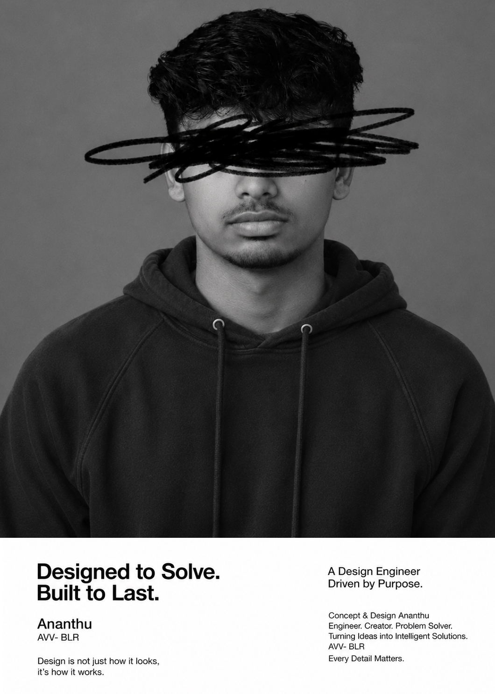

<!-- HEADER IMAGE -->
<div align="center">
  
</div>

<br/>
<br/>

<div align="center">
  <h2>Ananthu</h2>
  <p><b>DESIGN ENGINEER</b></p>
  <p><i>Bridging the gap between engineering and design.</i></p>
</div>

<br/>

<div align="center">
  <a href="https://ananthu.pages.dev/">Portfolio</a> &nbsp; ✦ &nbsp;
  <a href="https://www.linkedin.com/in/pananthapadmanabhan-nair/">LinkedIn</a> &nbsp; ✦ &nbsp;
  <a href="mailto:ananthupublications@gmail.com">Email</a>
</div>

<br/>
<br/>

---

### ✦ The Philosophy

I believe that engineering is a design discipline. A great product isn't just about how it looks; it's about how it feels, how it functions, and the story it tells through interaction. 

> *"Design is not just what it looks like and feels like. Design is how it works."*

<br/>

### ✦ The Toolkit

Instead of just writing code, I focus on building scalable systems and crafting native-feeling experiences through motion.

```javascript
const craft = {
  core: ["TypeScript", "React", "Next.js"],
  aesthetics: ["Tailwind CSS", "CSS Modules", "Radix UI"],
  motion: ["Framer Motion", "GSAP"],
  design: ["Figma", "Prototyping", "Design Systems"]
};
